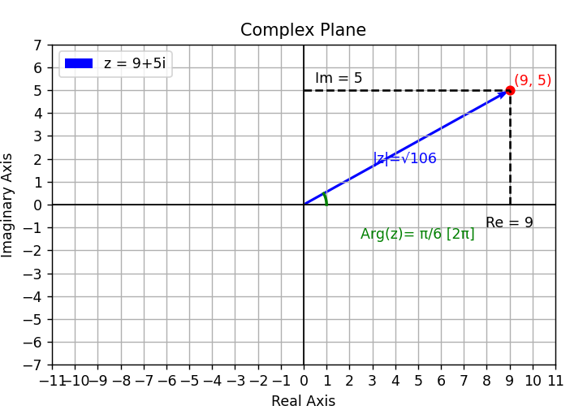

# Complex Numbers Class in Python

A class that lets you manipulate complex numbers and even plotting them.


## Screenshots




## Features

- Real and Imaginary parts
- Conjugate
- Module
- Argument


## Usage/Examples

```python
number = Complex(9,8)
```

```python
print(number)
>>> z = 9+8i
```

```python
number.showAttributes()
>>> Re(z)= 9 
    Im(z)= 8
    |z|= √145
    Arg(z)= π/4 [2π]
```

```python
print(number.conjugate())
>>> z = 9-8i
```
```python
print(number.module(exactValue=True))
>>> √145
```

```python
print(number.argument(exactValue=True))
>>> π/4 [2π]
```

```python
number.visualize()
```

